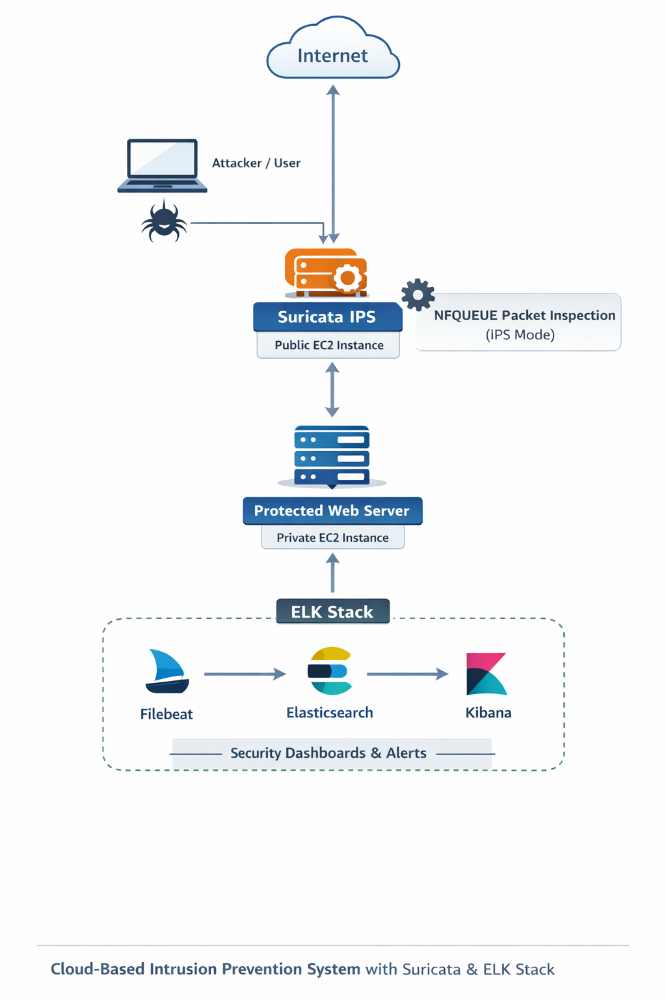

# 🚀 Cloud-Based Intrusion Prevention System (IPS) using Suricata & ELK Stack

## 📌 Project Overview
This project demonstrates the implementation of a real-time Intrusion Prevention System (IPS) to secure a web server hosted on AWS.  
It leverages Suricata in IPS mode (NFQUEUE) along with the ELK Stack (Elasticsearch, Filebeat, Kibana) for centralized logging, monitoring, and visualization of security events.

---

## 🏗️ Architecture
- Internet traffic is routed through a Suricata IPS EC2 instance
- Suspicious/malicious traffic is inspected and blocked in real-time
- Logs are forwarded using Filebeat to Elasticsearch
- Security dashboards and analysis are done in Kibana

📊 Refer to the architecture diagram below:



---

## ⚙️ Tech Stack
- Cloud: AWS EC2
- IDS/IPS: Suricata (IPS mode with NFQUEUE)
- Log Forwarding: Filebeat
- Search & Storage: Elasticsearch
- Visualization: Kibana
- OS: Ubuntu Linux

---

## 🔐 Key Features
- Real-time Intrusion Prevention (IPS mode) using Suricata  
- Geo-IP Blocking for restricting traffic from specific regions  
- Detection & blocking of SQL Injection attacks  
- Detection of Path Traversal attacks (e.g., /etc/passwd)  
- Centralized logging & visualization using ELK Stack  

---

## 🛠️ Implementation Steps

### 1. Setup AWS Infrastructure
- Created EC2 instances for:
  - Suricata IPS (Public)
  - Web Server (Private)
- Configured Security Groups for required ports and services

---

### 2. Configure Suricata in IPS Mode
Enabled NFQUEUE mode and applied iptables rule:

```bash
iptables -I FORWARD -j NFQUEUE --queue-num 0
```
### 3. Custom Rule Creation
- Example rule for blocking /etc/passwd attack:
```bash
drop http any any -> any any (msg:"ET WEB_SERVER /etc/passwd Detected in URI"; content:"/etc/passwd"; http_uri; sid:1000001; rev:1;)
```
---

### 4. ELK stack Integration
- Installed
  - Elasticsearch
  - Kibana
  - Filebeat

---

### 5. Kibana Dashboard Setup
- Used filters like:
```bash
event.kind : "alert"
```
- Visualized:
   - Attack types
   - Source IPs
   - Severity levels
   - URL
 
---
### 6. 🧪 Testing Attacks
```bash
http://<public-ip>/?id=../../../../etc/passwd
```

### 7. 📈 Results
- Successfully blocked malicious traffic in real-time
- Visualized attack patterns in Kibana dashboards
- Improved visibility into network threats

### 8. 🔗 Future Enhancements
- SIEM alerting (Email integration)
- Automation using Terraform
- Containerized deployment using Docker/Kubernetes

